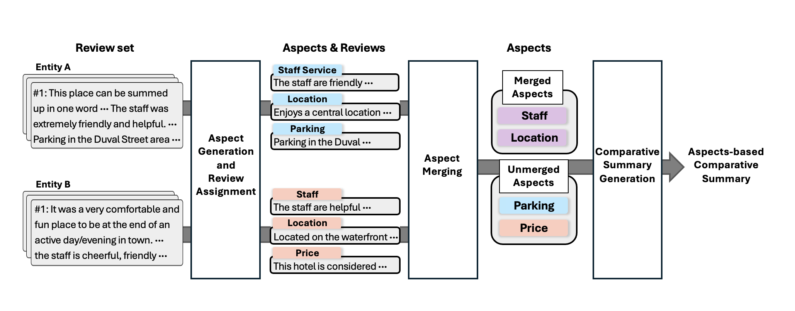

# Abstractive Aspect-Based Comparative Summarization
This repository contains the official code and datasets for the paper:
**"Abstractive Aspect-Based Comparative Summarization"**  
> Hyeon Jin, Chaewon Yoon, Yurim Oh, Hyun-Je Song  
> *Presented at the ACM Web Conference 2025 (WWW Companion '25), Sydney, Australia* 
## Overview
Comparative summarization aims to generate summaries highlighting the key similarities and differences between two entities. However, existing methods often fail to provide aspect-specific insights that are crucial for user decision-making.  
This work introduces **Abstractive Aspect-Based Comparative Summarization**, which:
- Identifies aspects of entities from a set of two reviews.
- Generates abstractive contrastive and common summaries for each aspect.
- Leverages Large Language Models (LLMs) for generating high-quality summaries.
<table align="center">
  <tr>
    <td align="center"> 
       
      <br>
      <em style="font-size: 18px;">  <strong style="font-size: 18px;">Figure 1: Overview of the proposed method 
    </td>
  </tr>
</table>
</div>
### Features:
- **Aspect-Based Summarization**: Summaries are structured around specific aspects such as "Staff", "Parking", "Price", etc.
- **Contrastive & Common Summaries**: Captures both **differences** and **similarities** between entities.
- **LLM-Powered**: Uses goal-driven clustering and hierarchical aspect merging to generate high-quality abstractive summaries.
- **New Benchmark Datasets**: Two datasets, **CoCoCom** (hotels) and **AmaCom** (Amazon products), designed for comparative summarization.
---
## Datasets
| Dataset  | # Pairs | Avg. # Reviews | Avg. # Aspects | Avg. Summary Length |
|----------|--------|---------------|---------------|---------------------|
| **CoCoCom** | 48     | 7.8           | 7.75          | 325.72              |
| **AmaCom**  | 646    | 77.78         | 11.56         | 368.45              |
- **CoCoCom**: Human-annotated comparative summaries from **TripAdvisor** hotel reviews.
- **AmaCom**: Summaries derived from **Amazon product categories** (Electronics, Home & Kitchen, Tools & Home Improvement).
---
## Installation
### Prerequisites:
- Python 3.8+
- PyTorch
- Hugging Face Transformers
- NLTK
- Scikit-learn
### Setup:
```bash
pip install -r requirements.txt
```
---
## Usage
### 1. Aspect-Based Summarization
Run the main script to generate aspect-based summaries:
```bash
python generate_summaries.py --input data/reviews.json --output results/summaries.json
```
### 2. Evaluation
Evaluate the summarization performance:
```bash
python evaluate.py --predictions results/summaries.json --references data/gold_summaries.json
```
---
## Citation
If you use this work, please cite:
```bibtex
@inproceedings{Jin2025AACSum,
  author    = {Hyeon Jin and Chaewon Yoon and Yurim Oh and Hyun-Je Song},
  title     = {Abstractive Aspect-Based Comparative Summarization},
  booktitle = {Companion Proceedings of the ACM Web Conference 2025},
  year      = {2025},
}
```