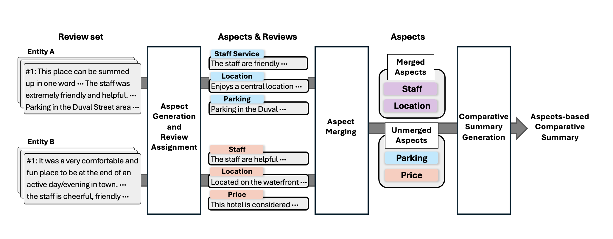

# [WWW2025 Short paper track]Abstractive aspect-based comparative summarization 
---

<table align="center">
  <tr>
    <td align="center"> 
       
      <br>
      <em style="font-size: 18px;">  <strong style="font-size: 18px;">Figure 1: Overview of the proposed method 
    </td>
  </tr>
</table>
</div>

# Abstract
Comparative summarization aims to generate a set of summaries
that highlight the relevant differences and commonalities between
two comparable entities. While these summaries provide users with
general comparative information, they may not fully meet users’
specific information needs, particularly when users seek detailed
information about specific aspects of the entities. In this paper, we
introduce the task of abstractive aspect-based comparative summa-
rization, which identifies the aspects of entities from a set of two
reviews and then generates abstractive contrastive and common
summaries for each aspect. To support this task, we construct two
new datasets and propose a simple large language model-based
summarization model that generates both aspects and the corre-
sponding contrastive and common summaries. Experimental results
on the newly constructed datasets demonstrate that the proposed
summarization model can generate higher-quality aspect-based
comparative summaries compared to the baselines.


# Aspect Merging Pipeline 📝
---
This repository provides a comprehensive pipeline for performing text compression, aspect merging, and summarization using state-of-the-art language models and APIs. The system is designed to handle paired review data and generate concise summaries by compressing text, assigning aspects, merging similar aspects, and summarizing the results.

## Features
✅ Text Compression: Compress long texts into concise representations using fine-tuned transformer models.

✅ Aspect Assignment: Assign aspects to compressed texts for better organization and understanding.

✅ Aspect Merging: Cluster and merge similar aspects from paired review data.

✅ Summarization: Generate summaries based on merged aspects.

# General Command Structure

```bash
python main.py \
    --data_path "<path_to_input_data>" \
    --model_family "<pretrained_model_family>" \
    --model "<path_to_finetuned_model>" \ 
    --result_path "<path_to_save_results>" \
    --prompt "<path_to_prompt_template>" \
    --api_key "<your_openai_api_key>" \
    --seed 1212 \
    --assigner_model "gpt-4o-mini" \
    --assigner_prompt "<path_to_assigner_prompt_template>" \
    [--comp_text] \
    [--merge]
```


## 1. Aspect Merging Only (--merge)
If you only want to perform aspect merging on pre-compressed text data:

```bash
python main.py \
    --data_path "/path/to/data" \
    --model_family "FacebookAI/xlm-roberta-large" \
    --model "/path/to/finetuned_model" \
    --result_path "/path/to/save/merged_results" \
    --prompt "/path/to/summarization_template.txt" \
    --api_key "<your_openai_api_key>" \
    --seed 1212 \
    --assigner_model "gpt-4o-mini" \
    --assigner_prompt "/path/to/assigner_prompt_template.txt" \
    --merge
```


## 2. Full Pipeline (--merge --comp_text)
To perform both text compression and aspect merging:

```bash
python main.py \
    --data_path "/path/to/data" \
    --model_family "FacebookAI/xlm-roberta-large" \
    --model "/path/to/finetuned_model" \
    --result_path "/path/to/save/merged_compressed_results" \
    --prompt "/path/to/summarization_template.txt" \
    --api_key "<your_openai_api_key>" \
    --seed 1212 \
    --assigner_model "gpt-4o-mini" \
    --assigner_prompt "/path/to/assigner_prompt_template.txt" \
    --merge \
    --comp_text
```


# Evaluation Script for COCOTRIP and AMASUM Datasets 📝
---
This repository contains an evaluation script designed to assess the performance of generated summaries on two datasets: COCOTRIP and AMASUM. The evaluation involves comparing generated results against a predefined benchmark using metrics like Rouge, BERTScore, and CASPR.

## Key Features 🚀
Dataset Support: COCOTRIP and AMASUM datasets.
# Metrics:
✅ Rouge: Measures overlap between generated and benchmark summaries.

✅ BERTScore: Evaluates semantic similarity.

✅ CASPR: Assesses comparative aspect similarity and polarity recognition.


## Example Commands

### Evaluate on COCOTRIP

```bash
CUDA_VISIBLE_DEVICES=1 python main.py \
  --dataset cocotrip \
  --bench_folder_path "/path/to/benchmark/cocotrip" \
  --result_folder_path "/path/to/results/cocotrip" \
  --save_path "/path/to/save/cocotrip_results"
```
Note: This evaluation is conducted exclusively on the test dataset

### Evaluate on AMASUM

```bash
CUDA_VISIBLE_DEVICES=1 python main.py \
  --dataset amasum \
  --bench_folder_path "/path/to/benchmark/amasum" \
  --result_folder_path "/path/to/results/amasum" \
  --save_path "/path/to/save/amasum_results"
  
```


## Benchmark Datasets
---
We publicly release benchmark datasets used in our evaluations.

The datasets are available at:
```bash
AACSum/Benchmark
```
These datasets contain paired review data and ground-truth summaries used for model evaluation.


## Contributors

Thanks to all the contributors who have helped build this project! 🙌


Thanks to these amazing contributors:

<a href="https://github.com/jhyun13">
  
</a>  
Hyeon Jin

<br>

<a href="https://github.com/lluvecwonv">
  
</a>  
Chaewon yoon

<br>

<a href="https://github.com/ohyurim1010">
  
</a>  
Yurim oh

